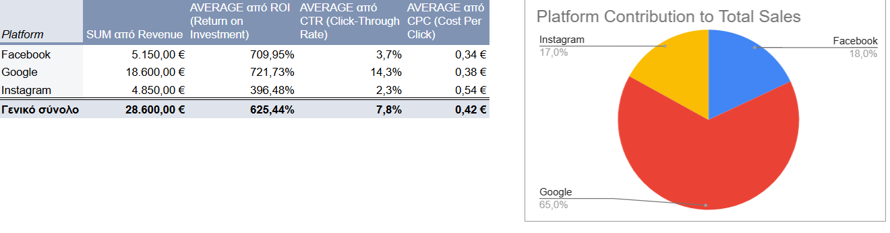
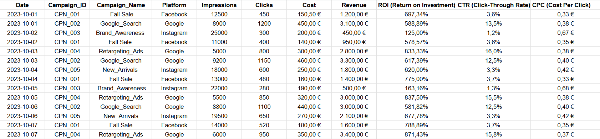

# Marketing Campaign Performance & ROI Analysis

## Επισκόπηση Project
Αυτό το project εστιάζει στην ανάλυση της απόδοσης διαφημιστικών καμπανιών σε τρεις διαφορετικές πλατφόρμες: **Google**, **Facebook** και **Instagram**. Χρησιμοποιώντας το **Google Sheets**, μετατράπηκαν ακατέργαστα δεδομένα (raw data) σε στρατηγικά συμπεράσματα για την κερδοφορία και την αποτελεσματικότητα των δαπανών marketing.

## Εργαλεία & Δεξιότητες
* **Εργαλείο:** Google Sheets / MS Excel
* **Data Cleaning:** Χρήση συναρτήσεων `TRIM`, αφαίρεση διπλοτύπων και μορφοποίηση δεδομένων (Currency/Date formats).
* **Calculated Metrics:** Υπολογισμός βασικών δεικτών απόδοσης (KPIs):
  * **ROI (Return on Investment):** `(Revenue - Cost) / Cost`
  * **CTR (Click-Through Rate):** `Clicks / Impressions`
  * **CPC (Cost Per Click):** `Cost / Clicks`
* **Data Analysis:** Χρήση **Pivot Tables** (Συγκεντρωτικοί Πίνακες) για ομαδοποίηση δεδομένων ανά πλατφόρμα.
* **Visualization:** Δημιουργία **Pie Charts** για την οπτικοποίηση του μεριδίου εσόδων (Revenue Share).

## Βασικά Συμπεράσματα (Key Insights)
Από την ανάλυση προέκυψαν τα εξής:
* **Google:** Ο "ηγέτης" των εσόδων με **18.600€** και το υψηλότερο ROI (**721,7%**), αποδεικνύοντας την αποτελεσματικότητα του Search marketing.
* **Facebook:** Η πιο οικονομική πλατφόρμα για την προσέλκυση χρηστών, με το χαμηλότερο **CPC (1,36€)** και το υψηλότερο **CTR (3,7%)**.
* **Instagram:** Η πλατφόρμα με τη χαμηλότερη απόδοση (ROI 396%), υποδεικνύοντας την ανάγκη για βελτιστοποίηση του δημιουργικού ή του targeting.

### 1. Dashboard & Pie Chart

### 2. Pivot Table Analysis

## Πώς να δείτε το Project
1. Μπορείτε να κατεβάσετε το αρχείο `.xlsx` από το repository.
2. Δείτε το live Google Sheet εδώ: https://docs.google.com/spreadsheets/d/1Fws9ixXb8jLt72h_cLYbCm0qpZ0gO5ePvH4aXUZYLvw/edit?gid=1916917881#gid=1916917881

---
*Αυτό το project αποτελεί μέρος του προσωπικού μου Portfolio.
